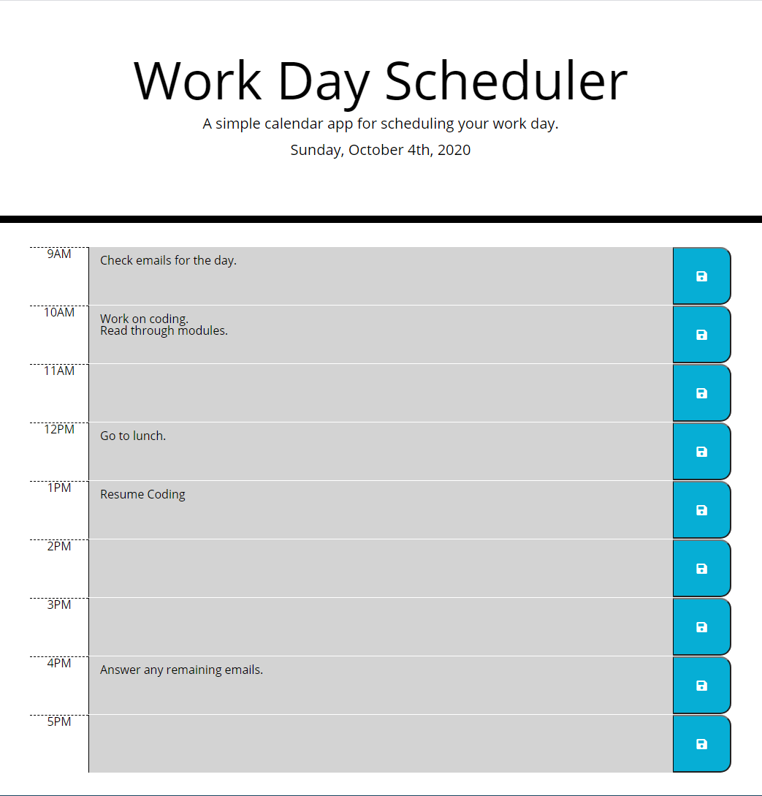

# Work Day Scheduler

## Description of the Website
This is a website that offers an hourly day planner with the ability to add items and keep track of time passing throughout the day.

 

## How it Works
* Simply click in the time slot and type in the task from your to-do list. After typing in the item, hit the "save" button to the right in order to keep the tasks, even if the browser refreshes or is closed and reopened again later.

 

## Website Features
* Color coding to keep track of time throughout the day. The form will automatically update throughout the day:
    * **Grey** indicates time slots already passed.
    * **Red** indicates the current time.
    * **Green** indicates time slots in the future.
* The top of the page will always show the current date.
* Saved items will automatically be brought up again, even if the browser is closed.
  
 

## Link to Work Day Scheduler
https://chriswein12.github.io/work-day-scheduler/

 

## How the Website Looks

 

## Credits

*- Project completed by Chris Wein*